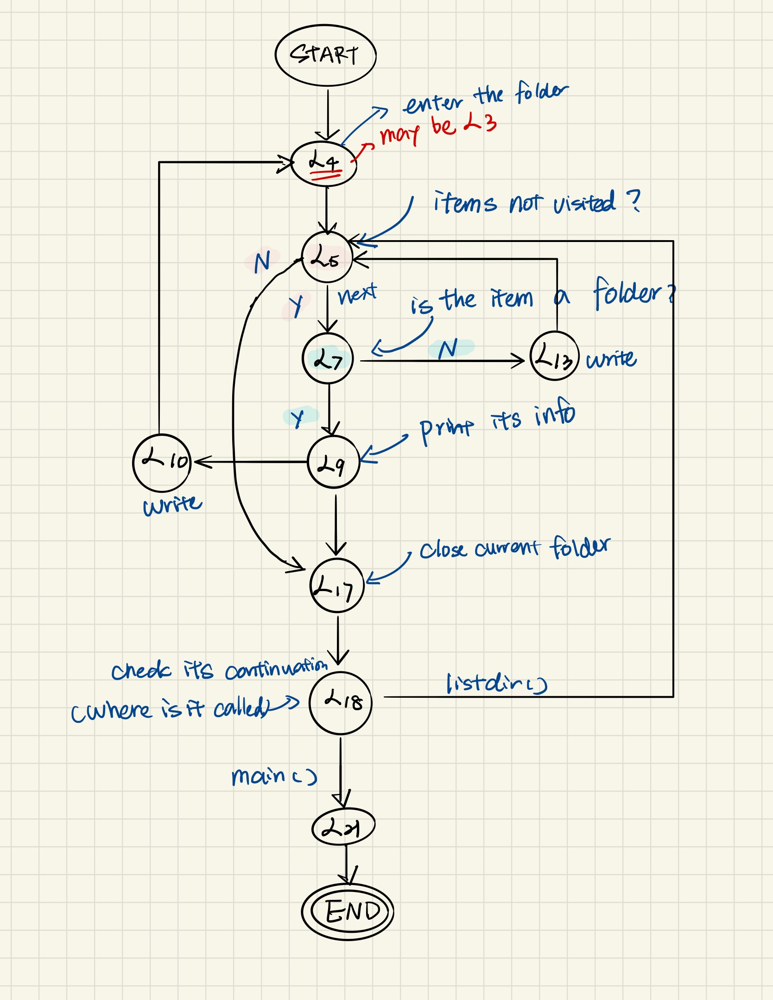
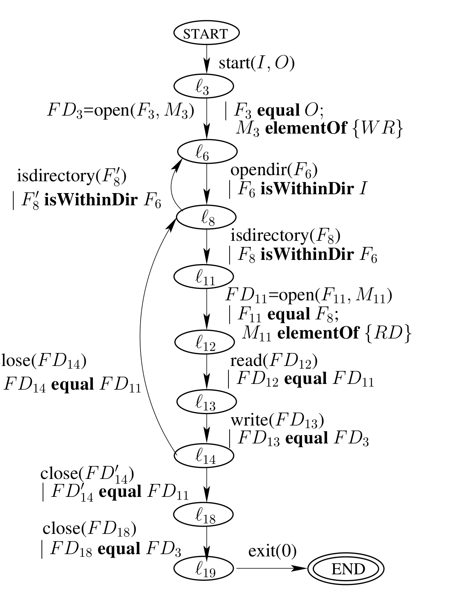
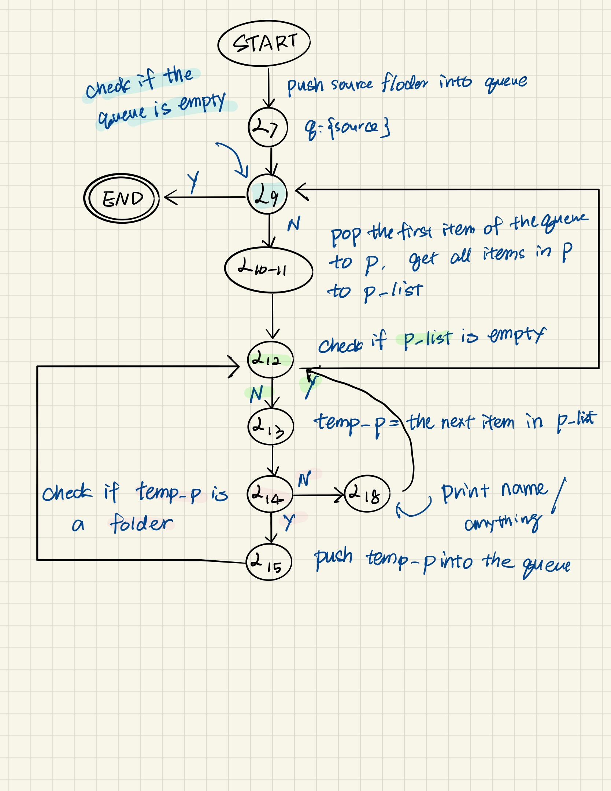

# Folders Traversal

## Original version

A recursive function in [`simple_traversal.c`](./simple_traversal.c):

```c
void listdir(char *name)
{
    DIR *dir;struct dirent *entry;int count;
    dir = open(name, RD);
    while (getdents(dir, entry, count) > 0) {
        foreach (dir_entry in entry) {
            if (isdir(entry->d_type)) {
                char path[1024];
                snprintf(path, 1024, "%s/%s", name, entry->d_name);
                write(1, entry->d_name);
                listdir(path);
            } else {
                write(1, entry->d_name);
            }
        }
    }
    close(dir);
}
int main(int argc, char *argv[]) {
    listdir(argv[1]);
    exit(0);
}
```

Hand-write FSM:



## Non-recursive DFS Pseudo-Code

[`simplatar.c`](./simpletar.c) is listed in the paper [Dataflow Anomaly Detection](http://citeseerx.ist.psu.edu/viewdoc/download?doi=10.1.1.80.6279&rep=rep1&type=pdf):

>It traverses the directory (`source_dir`), which may contain subdirectories, and copies all the files into the archive.

```c
int main(int argc, char **argv){
    source_dir = argv[1]; target_file = argv[2];
    target_fd = open(target file, WR);
    push(source_dir); // uses a global stack
    while (dir_name = pop()) != NULL) {
            dir = opendir(dir_name);
            foreach (dir entry in dir) {
                if (isdirectory(dir_entry))
                    push(dir_entry);
                else {
                    source_fd = open(dir_entry, RD);
                    read(source_fd, buf);
                    write(target_fd, buf);
                    close(source_fd);
                }
            }
        }
    close(target_fd);
    exit(0);
}
```

Its FSM given by the paper:



## Non-recursive BFS Python Code

Write a simple Python program [`traversal.py`](./traversal.py) that runs properly:

```python
import os
from queue import Queue

path = "../"  # source folder

q = Queue()
q.put(path)

while not q.empty():
    p = q.get()
    p_list = os.listdir(p)
    for i in p_list:
        temp_p = os.path.join(p, i)
        if os.path.isdir(temp_p):
            q.put(temp_p)
            continue
        # do something
        print(temp_p)
```

The FSM drawn by hand:



## Miscellaneous

- [Walk a directory/Recursively](https://rosettacode.org/wiki/Walk_a_directory/Recursively)
- [Walk a directory/Non-recursively](https://rosettacode.org/wiki/Walk_a_directory/Non-recursively)
